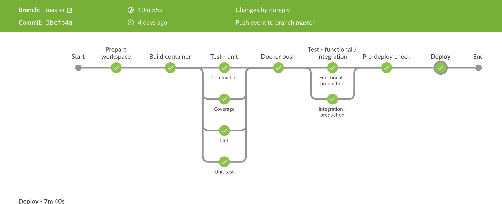

Design Doc
===

The basics of how this system will run
1. There will be a main Jenkins node where all jobs will be scheduled
1. There will be 1 or more Jenkins slave where the build jobs will actually be run on
1. There will be at least 4 Jenkins jobs
    1. A job to build and unit test the absolute_api. It will output a docker image as an artifact to a docker registry
    1. A job to create and update our kubernetes cluster (our operations code base will change as we go)
        - this will run by cloning this repo and running ansible playbooks as required
        - there will be a jenkins lock/mutex on the environment to make sure other jobs don't update at the same time
    1. A job to update our new kubernetes cluster with the latest absolute_api docker image 
    1. A job to perform integration testing against this kubernetes environment

CI/CD pipeline
---
Any good service requires a end-to-end pipeline to build, test, and deploy a service. In the case of this new service
In this example I will be using Jenkins as it is the a widely used and well known build manager/scheduler/orchestrator. 

Jenkins notes
- we will be using jenkins groovy scripting plugin to make sure each repo is responsible for configuring their own jenkins job in code (Jenkinsfile).
- we will be using the jenkins pipelines plugin to get a better picture of how each build links to the next one
- All of the jenkins jobs will be setup so they are downstream from eachother. Essentially when one completes successfully it will trigger the next job

A diagram I have found that shows a high level outline extremely similar to how I would expect the process for this service to work can be found below.
Ignore any references to curl

Note this diagram was not created by me, the original source can be found at:
https://dzone.com/articles/easily-automate-your-cicd-pipeline-with-jenkins-he

This high level diagram outlines the flows of how a push of git code for this repo will flow from environment to environment being tested as it goes.
Notices how it talks about building docker images, deploying to environments, and most importantly testing code. This process should be automated as much
as possible and only have human intervention at later steps (such as manual QA final signoff). I am not too familiar with helm but in the end its not really
important here. What is important is when and where in the process we do the deployments.

A slightly more detailed diagram of a single stage (build, test, deploy) of ci/cd against can be found below.

This diagram is from an actual jenkins job. It puts together steps 1-4 is the higher level diagram into a single jenkins view (using jenkins pipelines plugin).

This diagram comes from https://godaddy.github.io/2018/06/05/cicd-best-practices/ but is almost exactly how I would configure my pipeline to build,test,& deploy my aboslute-api service.

Whats important to note here is this pipeline view only covers the initial portion of the higher level diagram. This is the hardest and most complicated part
of the ci/cd pipeline. Later on when we deploy our tested codebase to upstream environments (qa, rc. staging, etc...) we will only need to focus on the functional testing/integration and the deployment portion.
We should be using the docker image created+tested much earlier in the process. The idea here is to have a single artifact tested and used everwhere with separate environment specific configuration provided
through some other means (puppet, chef, s3 bucket, volume mounting, etc..).

Service on AWS
---
Not sure if this is required but I just thought I would give a rough outline of what the AWS architecture would look like. I was be discussing using AWS ECS instead EKS only because
they are comparable and I am much more familar with ECS (amazon custom container orchestration product) then EKS (kubernetes).
In AWS VPC is the highest level concept, we will have 1 VPC. Since our api will be public we will have 2 public subnets. Each subnet will be in a different AWS available zone (AZ).
This will provide us with some redudency should 1 AZ go offline (or some other error). We will leverage AWS Auto Scaling Groups (ASG) to launch and manage our EC2 instances.
We will configure it to launch a minimum of 2 EC2 instances. 1 in each available zone. We will configure the maximum to be 4 instances. By setting this value to be double the minimum number of instances
we assure ourselves when we do production updates we can keep the old instances running while new ones are launched concurrently. 
Next we will setup a ECS Task definition which represents all the information needed to launch 
absolute_api docker container (amount of RAM, CPU, environment variables, etc..). From there we will create an AWS ECS service which specifies that we wish to launch how many of a given Task definition.
Our task definition currently only contains a single docker image (absolute_api). We will also configure AWS ECS Service to distribute the running containers far away from eachother (meaning not on the same VM).
This is important as otherwise both containers could be scheduled to run on the same EC2/VM instance out of the box which would defeat our reduancy goals (and possible hurt performance). Finally we need to setup an ALB
to work with this AWS ECS Service. The ALB will take incoming user requests and decide which instance/container to route the requests to. By default it will alternate between our 2 running instances. This is fine for our
stateless rest api. Should we have persistent user state then we would enable sticky-sessions to make sure requests from one user always went to the same container.

I have talked a bit about what AWS services we should use but one thing I did not mention is how configuration of the service should be handled. To keep things extremely simple and not introduce another technology
I will have the absolute_service automatically pull its configuration from an S3 bucket (rather then using something like a sidecar container with puppet/chef).

All of this infrastructure should be created using either cloudformation, terraform, or a programming language supported by a aws-sdk. My personal preference would be cloudformation in this case because of 1st party support
directly from amazon and that we are only running a simple setup. If we were to go multi-cloud or have a much more complicated infrastructure setup I may consider using terraform for its better support of
individual modules/files that can be better reused/composed. We will also need some mechanism to upload our service configuration file(s) to s3. This should be relatively simple to do.